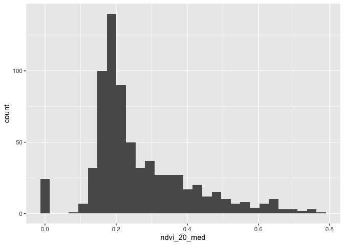
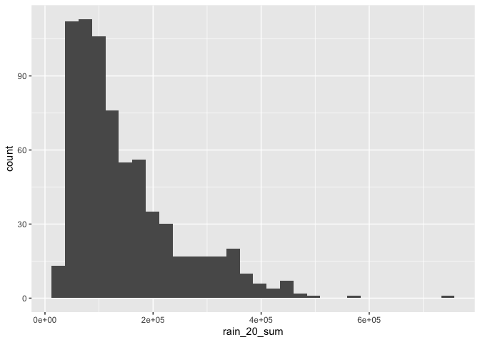

Geog6300: Lab 6
================

## Regression

``` r
library(sf)
library(tidyverse)
```

**Overview:** This lab focuses on regression techniques. You’ll be
analyzing the association of various physical and climatological
characteristics in Australia with observations of several animals
recorded on the citizen science app iNaturalist.

\###Data and research questions###

Let’s import the dataset.

``` r
lab6_data<-st_read("data/aus_climate_inat.gpkg")
```

    ## Reading layer `aus_climate_inat' from data source 
    ##   `/Users/kealeycollison/GEOG6300L6/data/aus_climate_inat.gpkg' 
    ##   using driver `GPKG'
    ## Simple feature collection with 716 features and 22 fields
    ## Geometry type: POLYGON
    ## Dimension:     XY
    ## Bounding box:  xmin: 113.875 ymin: -43.38632 xmax: 153.375 ymax: -11.92074
    ## Geodetic CRS:  WGS 84 (CRS84)

The dataset for this lab is a 1 decimal degree hexagon grid that has
aggregate statistics for a number of variables:

- ndvi: NDVI/vegetation index values from Landsat data (via Google Earth
  Engine). These values range from -1 to 1, with higher values
  indicating more vegetation.
- maxtemp_00/20_med: Median maximum temperature (C) in 2000 or 2020
  (data from SILO/Queensland government)
- mintemp_00/20_med: Median minimum temperature (C) in 2020 or 2020
  (data from SILO/Queensland government)
- rain_00/20_sum: Total rainfall (mm) in 2000 or 2020 (data from
  SILO/Queensland government)
- pop_00/20: Total population in 2000 or 2020 (data from NASA’s Gridded
  Population of the World)
- water_00/20_pct: Percentage of land covered by water at some point
  during the year in 2000 or 2020
- elev_med: Median elevation (meters) (data from the Shuttle Radar
  Topography Mission/NASA)

There are also observation counts from iNaturalist for several
distinctively Australian animal species: the central bearded dragon, the
common emu, the red kangaroo, the agile wallaby, the laughing
kookaburra, the wombat, the koala, and the platypus.

Our primary research question is how the climatological/physical
variables in our dataset are predictive of the NDVI value. We will build
models for 2020 as well as the change from 2000 to 2020. The second is
referred to as a “first difference” model and can sometimes be more
useful for identifying causal mechanisms.

\###Part 1: Analysis of 2020 data###

We will start by looking at data for 2020.

**Question 1** *Create histograms for NDVI, max temp., min temp., rain,
and population, and water in 2020 as well as elevation. Based on these
graphs, assess the normality of these variables.*

``` r
ggplot(lab6_data,aes(x=ndvi_20_med))+
  geom_histogram()
```

    ## `stat_bin()` using `bins = 30`. Pick better value with `binwidth`.

<!-- -->

``` r
ggplot(lab6_data,aes(x=maxtemp_20_med))+
  geom_histogram()
```

    ## `stat_bin()` using `bins = 30`. Pick better value with `binwidth`.

<!-- -->

``` r
ggplot(lab6_data,aes(x=mintemp_20_med))+
  geom_histogram()
```

    ## `stat_bin()` using `bins = 30`. Pick better value with `binwidth`.

<!-- -->

``` r
ggplot(lab6_data,aes(x=rain_20_sum))+
  geom_histogram()
```

    ## `stat_bin()` using `bins = 30`. Pick better value with `binwidth`.

<!-- -->

``` r
ggplot(lab6_data,aes(x=pop_20))+
  geom_histogram()
```

    ## `stat_bin()` using `bins = 30`. Pick better value with `binwidth`.

<!-- -->

``` r
ggplot(lab6_data,aes(x=water_20_pct))+
  geom_histogram()
```

    ## `stat_bin()` using `bins = 30`. Pick better value with `binwidth`.

<!-- -->

``` r
ggplot(lab6_data,aes(x=elev_med))+
  geom_histogram()
```

    ## `stat_bin()` using `bins = 30`. Pick better value with `binwidth`.

<!-- -->

{Based off of thier histograms, none of these varibles look completely
normal. NDVI’s histogram looks like it is skewed to the right. Max
temp’s histogram looks like it is skewed to the left. Min temp’s
histogram looks like it is skewed to the left to a slighly lesser
degree. Rain’s histogram looks like it is right skewed. Population’s
histogram looks like it is skewed to the right to an exterme degree with
alot of values at or near 0. Water’s histogram also looks like it is
extreamly skewed to the right with lots of 0 or near 0 values, and
elevation’s histogram looks like it is skewed to the right to a lesser
degree.}

**Question 2** *Use tmap to map these same variables using Jenks natural
breaks as the classification method. For an extra challenge, use
`tmap_arrange` to plot all maps in a single figure.*

``` r
library(tmap)
```

    ## 
    ## Attaching package: 'tmap'

    ## The following object is masked from 'package:datasets':
    ## 
    ##     rivers

``` r
tm1 <- tm_shape(lab6_data)+
  tm_polygons("ndvi_20_med", style="jenks", palette = "brewer.rd_yl_gn")
```

    ## 

    ## ── tmap v3 code detected ───────────────────────────────────────────────────────

    ## [v3->v4] `tm_polygons()`: instead of `style = "jenks"`, use fill.scale =
    ## `tm_scale_intervals()`.
    ## ℹ Migrate the argument(s) 'style', 'palette' (rename to 'values') to
    ##   'tm_scale_intervals(<HERE>)'

``` r
tm2 <- tm_shape(lab6_data)+
  tm_polygons("maxtemp_20_med", style="jenks", palette = "brewer.yl_or_br")

tm3 <- tm_shape(lab6_data)+
  tm_polygons("mintemp_20_med", style="jenks", palette = "brewer.yl_or_br")

tm4 <- tm_shape(lab6_data)+
  tm_polygons("rain_20_sum", style="jenks", palette = "blues")

tm5 <- tm_shape(lab6_data)+
  tm_polygons("pop_20", style="jenks", palette = "brewer.yl_or_br")

tm6 <- tm_shape(lab6_data)+
  tm_polygons("water_20_pct", style="jenks",  palette = "blues")

tm7 <- tm_shape(lab6_data)+
  tm_polygons("elev_med", style="jenks")

tmap_arrange(tm1, tm2, tm3, tm4, tm5, tm6, tm7, ncol = 2, nrow = 4)
```

    ## [plot mode] fit legend/component: Some legend items or map compoments do not fit well, and are therefore rescaled. Set the tmap option 'component.autoscale' to FALSE to disable rescaling.
    ## [plot mode] fit legend/component: Some legend items or map compoments do not fit well, and are therefore rescaled. Set the tmap option 'component.autoscale' to FALSE to disable rescaling.
    ## [plot mode] fit legend/component: Some legend items or map compoments do not fit well, and are therefore rescaled. Set the tmap option 'component.autoscale' to FALSE to disable rescaling.
    ## [plot mode] fit legend/component: Some legend items or map compoments do not fit well, and are therefore rescaled. Set the tmap option 'component.autoscale' to FALSE to disable rescaling.
    ## [plot mode] fit legend/component: Some legend items or map compoments do not fit well, and are therefore rescaled. Set the tmap option 'component.autoscale' to FALSE to disable rescaling.
    ## [plot mode] fit legend/component: Some legend items or map compoments do not fit well, and are therefore rescaled. Set the tmap option 'component.autoscale' to FALSE to disable rescaling.
    ## [scale] tm_polygons:() the data variable assigned to 'fill' contains positive and negative values, so midpoint is set to 0. Set 'midpoint = NA' in 'fill.scale = tm_scale_intervals(<HERE>)' to use all visual values (e.g. colors)
    ## [plot mode] fit legend/component: Some legend items or map compoments do not fit well, and are therefore rescaled. Set the tmap option 'component.autoscale' to FALSE to disable rescaling.

<!-- -->

**Question 3** *Based on the maps from question 3, summarise major
patterns you see in the spatial distribution of these data from any of
your variables of interest. How do they appear to be associated with the
NDVI variable?*

{The map of the NDVI shoes that vegitation is mainly concentrated on the
outer parts of Australia. The temperature maps shows that it is
generally hotter in the top parts of Australia and cooler in the lower
areas. Rain also appears to be concentrated on the outer parts of
Australia and appers lines up fairly closely to vergetation. The
popualtion map shows that most people are living in the bottom right
areas in autralia where there is more vegitation. Water is somewhat
concentrated on the outer areas and middle right parts of autralia.
Fianlly elevation appears to be higher in the inner left and outer right
parts of Australia. }

**Question 4** *Create univariate models for each of the variables
listed in question 1, with NDVI in 2020 as the dependent variable. Print
a summary of each model. Write a summary of those results that indicates
the direction, magnitude, and significance for each model coefficient.*

``` r
model1 <- lm(ndvi_20_med ~ maxtemp_20_med, data = lab6_data)
summary(model1)
```

    ## 
    ## Call:
    ## lm(formula = ndvi_20_med ~ maxtemp_20_med, data = lab6_data)
    ## 
    ## Residuals:
    ##      Min       1Q   Median       3Q      Max 
    ## -0.41874 -0.07657 -0.01927  0.06833  0.36382 
    ## 
    ## Coefficients:
    ##                  Estimate Std. Error t value Pr(>|t|)    
    ## (Intercept)     0.6612389  0.0294372   22.46   <2e-16 ***
    ## maxtemp_20_med -0.0130902  0.0009601  -13.63   <2e-16 ***
    ## ---
    ## Signif. codes:  0 '***' 0.001 '**' 0.01 '*' 0.05 '.' 0.1 ' ' 1
    ## 
    ## Residual standard error: 0.1251 on 714 degrees of freedom
    ## Multiple R-squared:  0.2066, Adjusted R-squared:  0.2055 
    ## F-statistic: 185.9 on 1 and 714 DF,  p-value: < 2.2e-16

``` r
model2 <- lm(ndvi_20_med ~ mintemp_20_med, data = lab6_data)
summary(model2)
```

    ## 
    ## Call:
    ## lm(formula = ndvi_20_med ~ mintemp_20_med, data = lab6_data)
    ## 
    ## Residuals:
    ##      Min       1Q   Median       3Q      Max 
    ## -0.36375 -0.08418 -0.03047  0.06972  0.40383 
    ## 
    ## Coefficients:
    ##                 Estimate Std. Error t value Pr(>|t|)    
    ## (Intercept)     0.464461   0.018997   24.45   <2e-16 ***
    ## mintemp_20_med -0.012282   0.001131  -10.86   <2e-16 ***
    ## ---
    ## Signif. codes:  0 '***' 0.001 '**' 0.01 '*' 0.05 '.' 0.1 ' ' 1
    ## 
    ## Residual standard error: 0.1301 on 714 degrees of freedom
    ## Multiple R-squared:  0.1418, Adjusted R-squared:  0.1406 
    ## F-statistic:   118 on 1 and 714 DF,  p-value: < 2.2e-16

``` r
model3 <- lm(ndvi_20_med ~ rain_20_sum, data = lab6_data)
summary(model3)
```

    ## 
    ## Call:
    ## lm(formula = ndvi_20_med ~ rain_20_sum, data = lab6_data)
    ## 
    ## Residuals:
    ##      Min       1Q   Median       3Q      Max 
    ## -0.56681 -0.04753 -0.01210  0.04599  0.30930 
    ## 
    ## Coefficients:
    ##              Estimate Std. Error t value Pr(>|t|)    
    ## (Intercept) 1.303e-01  7.060e-03   18.45   <2e-16 ***
    ## rain_20_sum 9.124e-07  3.953e-08   23.08   <2e-16 ***
    ## ---
    ## Signif. codes:  0 '***' 0.001 '**' 0.01 '*' 0.05 '.' 0.1 ' ' 1
    ## 
    ## Residual standard error: 0.1063 on 714 degrees of freedom
    ## Multiple R-squared:  0.4273, Adjusted R-squared:  0.4265 
    ## F-statistic: 532.6 on 1 and 714 DF,  p-value: < 2.2e-16

``` r
model4 <- lm(ndvi_20_med ~ pop_20, data = lab6_data)
summary(model4)
```

    ## 
    ## Call:
    ## lm(formula = ndvi_20_med ~ pop_20, data = lab6_data)
    ## 
    ## Residuals:
    ##      Min       1Q   Median       3Q      Max 
    ## -0.47003 -0.07883 -0.03949  0.06384  0.48974 
    ## 
    ## Coefficients:
    ##              Estimate Std. Error t value Pr(>|t|)    
    ## (Intercept) 2.552e-01  5.013e-03  50.902   <2e-16 ***
    ## pop_20      1.500e-06  1.500e-07   9.998   <2e-16 ***
    ## ---
    ## Signif. codes:  0 '***' 0.001 '**' 0.01 '*' 0.05 '.' 0.1 ' ' 1
    ## 
    ## Residual standard error: 0.1316 on 714 degrees of freedom
    ## Multiple R-squared:  0.1228, Adjusted R-squared:  0.1216 
    ## F-statistic: 99.97 on 1 and 714 DF,  p-value: < 2.2e-16

``` r
model5 <- lm(ndvi_20_med ~ water_20_pct, data = lab6_data)
summary(model5)
```

    ## 
    ## Call:
    ## lm(formula = ndvi_20_med ~ water_20_pct, data = lab6_data)
    ## 
    ## Residuals:
    ##      Min       1Q   Median       3Q      Max 
    ## -0.26898 -0.08838 -0.04838  0.06871  0.50911 
    ## 
    ## Coefficients:
    ##               Estimate Std. Error t value Pr(>|t|)    
    ## (Intercept)   0.268988   0.006287  42.781   <2e-16 ***
    ## water_20_pct -0.178263   0.154480  -1.154    0.249    
    ## ---
    ## Signif. codes:  0 '***' 0.001 '**' 0.01 '*' 0.05 '.' 0.1 ' ' 1
    ## 
    ## Residual standard error: 0.1403 on 714 degrees of freedom
    ## Multiple R-squared:  0.001862,   Adjusted R-squared:  0.0004636 
    ## F-statistic: 1.332 on 1 and 714 DF,  p-value: 0.2489

``` r
model6 <- lm(ndvi_20_med ~ elev_med, data = lab6_data)
summary(model6)
```

    ## 
    ## Call:
    ## lm(formula = ndvi_20_med ~ elev_med, data = lab6_data)
    ## 
    ## Residuals:
    ##      Min       1Q   Median       3Q      Max 
    ## -0.27082 -0.09585 -0.04270  0.07954  0.44272 
    ## 
    ## Coefficients:
    ##              Estimate Std. Error t value Pr(>|t|)    
    ## (Intercept) 2.138e-01  9.741e-03  21.952  < 2e-16 ***
    ## elev_med    1.787e-04  2.895e-05   6.171 1.14e-09 ***
    ## ---
    ## Signif. codes:  0 '***' 0.001 '**' 0.01 '*' 0.05 '.' 0.1 ' ' 1
    ## 
    ## Residual standard error: 0.1369 on 714 degrees of freedom
    ## Multiple R-squared:  0.05064,    Adjusted R-squared:  0.04931 
    ## F-statistic: 38.08 on 1 and 714 DF,  p-value: 1.136e-09

{The coefficient for the model with max temperature was -0.013, and the
direction is negative, which means that on average as max temperature
increases by 1 degree C, the NDVI decreases by 0.013 all else equal.
This model was significant and had a very small p-value.

The coefficient for the model with min temperature was -0.012. Similar
to before, the direction is negative. This means that on average as min
temperature increases by 1 degree C, the NDVI decreases by 0.012. This
model was significant and had a very small p-value.

The coefficient for the model with rain was 9.124e-07 or 0.0000009124.
The direction is positive which means that on average as total rainfall
increases by 1mm, the NDVI increases by 9.124e-07. This model was
significant and had a very small p-value.

The coefficient for the model with population was 1.500e-06 or
0.0000015. The direction is also positive. This means that on average as
population increases by 1, the NDVI increases by 1.500e-06. This model
was significant and had a very small p-value.

The coefficient for the model with water was -0.178. The direction is
surprisingly negative which means that on average as of the amount land
covered by water increase by 1%, the NDVI decreases by 0.178. This model
was not very significant and had a p-value of 0.249.

The coefficient for the model with elevation was 1.787e-04 or 0.0001787.
The direction is positive which means that on average as median
elevation increases by 1 meter, the NDVI increases by 1.787e-04. This
model was significant and had a very small p-value.}

**Question 5** *Create a multivariate regression model with the
variables of interest, choosing EITHER max or min temperature (but not
both) You may also choose to leave out any variables that were
insignificant in Q4. Use the univariate models as your guide. Call the
results.*

``` r
model7 <- lm(ndvi_20_med ~ maxtemp_20_med + rain_20_sum + pop_20 + elev_med, data = lab6_data)
summary(model7)
```

    ## 
    ## Call:
    ## lm(formula = ndvi_20_med ~ maxtemp_20_med + rain_20_sum + pop_20 + 
    ##     elev_med, data = lab6_data)
    ## 
    ## Residuals:
    ##      Min       1Q   Median       3Q      Max 
    ## -0.50217 -0.02838  0.00409  0.03919  0.20570 
    ## 
    ## Coefficients:
    ##                  Estimate Std. Error t value Pr(>|t|)    
    ## (Intercept)     4.571e-01  2.194e-02  20.828  < 2e-16 ***
    ## maxtemp_20_med -1.170e-02  6.796e-04 -17.220  < 2e-16 ***
    ## rain_20_sum     8.469e-07  3.263e-08  25.953  < 2e-16 ***
    ## pop_20          2.862e-07  1.044e-07   2.741  0.00627 ** 
    ## elev_med        1.233e-04  1.796e-05   6.864 1.46e-11 ***
    ## ---
    ## Signif. codes:  0 '***' 0.001 '**' 0.01 '*' 0.05 '.' 0.1 ' ' 1
    ## 
    ## Residual standard error: 0.0845 on 711 degrees of freedom
    ## Multiple R-squared:  0.6397, Adjusted R-squared:  0.6376 
    ## F-statistic: 315.5 on 4 and 711 DF,  p-value: < 2.2e-16

**Question 6** *Summarize the results of the multivariate model. What
are the direction, magnitude, and significance of each coefficient? How
did it change from the univariate models you created in Q4 (if at all)?
What do the R2 and F-statistic values tell you about overall model fit?*

{The multivariate model I used had NDVI as the dependent variable and
max temperature, rain, population, and elevation as the independent
variables.

The coefficient for max temperature was -1.170e-02 or -0.0117. The
(absolute value) magnitude of this coefficient was slightly smaller than
than it was in the univariate regression. It’s direction was still
negative and significant with a very small p-value. This means that on
average as max temperature increases by 1 degree C, the NDVI decreases
by 0.0117.

The coefficient for rain was 8.469e-07 or 0.0000008469 which was also
slightly smaller than it was than it was in the univariate regression.
Its direction was positive and it was also significant with a very small
p-value. This means that on average as rainfall increases by 1mm, the
NDVI increases by 8.469e-07.

The coefficient for population was 2.862e-07 or 0.0000002862, and it’s
magnitude was smaller than it was in the univariate regression. It’s
direction was positive, and it was significant at the 0.001 level. This
means that on average as population increases by 1, the NDVI increases
by 2.862e-07.

The coefficient for elevation was 1.233e-04 or 0.0001233. The magnitude
for this coefficient was slightly smaller that it was in with the
univariate regression. It’s direction was positive, and it was
significant with a very small p-value. This means that on average as
elevation increases by 1 meter, the NDVI increases by 1.233e-04.

The R2 for this model was 0.6397 indicating that about 64% of the
variation in the NDVI variable could be explained by the model. The
F-statistic was 315.5 with a very small p-value meaning that the model
used was better than one with no independent variables and the variables
included improve the model fit.}

**Question 7** *Use a histogram and a map to assess the normality of
residuals and any spatial autocorrelation. Summarise any notable
patterns that you see.*

``` r
lab6_data$residuals7<-residuals(model7)

ggplot(lab6_data,aes(x=residuals7))+
  geom_histogram()
```

    ## `stat_bin()` using `bins = 30`. Pick better value with `binwidth`.

<!-- -->

``` r
tm_shape(lab6_data) +
  tm_dots("residuals7",size=0.5)
```

    ## [scale] tm_dots:() the data variable assigned to 'fill' contains positive and negative values, so midpoint is set to 0. Set 'midpoint = NA' in 'fill.scale = tm_scale_intervals(<HERE>)' to use all visual values (e.g. colors)

<!-- -->

``` r
tm_shape(lab6_data)+
  tm_polygons("residuals7", style="jenks", palette = "brewer.rd_yl_gn")
```

    ## 
    ## ── tmap v3 code detected ───────────────────────────────────────────────────────
    ## [v3->v4] `tm_polygons()`: instead of `style = "jenks"`, use fill.scale =
    ## `tm_scale_intervals()`.
    ## ℹ Migrate the argument(s) 'style', 'palette' (rename to 'values') to
    ##   'tm_scale_intervals(<HERE>)'[scale] tm_polygons:() the data variable assigned to 'fill' contains positive and negative values, so midpoint is set to 0. Set 'midpoint = NA' in 'fill.scale = tm_scale_intervals(<HERE>)' to use all visual values (e.g. colors)

<!-- -->

{The residuals do not appear to be completly normal. A histogram of the
residuals revels a slight tail on the negative side. When mapping the
residuals the more extreme positive and negative values appear to be
concentrated on the outskirts of Australia.}

**Question 8** *Assess any issues with multicollinearity or
heteroskedastity in this model using the techniques shown in class. Run
the appropriate tests and explain what their results show you.*

``` r
#Code goes here
library(car)
```

    ## Loading required package: carData

    ## 
    ## Attaching package: 'car'

    ## The following object is masked from 'package:dplyr':
    ## 
    ##     recode

    ## The following object is masked from 'package:purrr':
    ## 
    ##     some

``` r
vif(model7)
```

    ## maxtemp_20_med    rain_20_sum         pop_20       elev_med 
    ##       1.098705       1.078449       1.173863       1.009305

``` r
library(lmtest)
```

    ## Loading required package: zoo

    ## 
    ## Attaching package: 'zoo'

    ## The following objects are masked from 'package:base':
    ## 
    ##     as.Date, as.Date.numeric

``` r
bptest(model7)
```

    ## 
    ##  studentized Breusch-Pagan test
    ## 
    ## data:  model7
    ## BP = 122.21, df = 4, p-value < 2.2e-16

{I ran a vif test to check for multicollinearity. None of the results of
this test are above 5 for any of the independent variables meaning that
there in not substantial levels of multicollinearity in the model I
used.

I ran a Breusch-Pagan test to check for heteroskedastity. The p-value of
the test was whcih suggests the there is heteroskedastity. }

**Question 9** *How would you summarise the results of this model in a
sentence or two? In addition, looking at the full model and your
diagnostics, do you feel this is a model that provides meaningful
results? Explain your answer.*

``` r
#Discussion here
```

The model above explains a decent amount of the variation in NDVI and
indicates that in Australia temperature has a significant negative
relationship with vegetation, and rain, population, and elevation are
significantly and positively related to vegetation. However, there might
be some issues with the estimation and interpretation of this model due
to the potential presence of heteroskedastity, spatial autocorrelation,
and non normal residuals. I would not count on this model for very
precise and accurate estimates, but, despite the issues with the model,
I still think the results have value and can give someone a general idea
of the relationship between vegetation and other factors in Australia.

**Disclosure of assistance:** *Besides class materials, what other
sources of assistance did you use while completing this lab? These can
include input from classmates, relevant material identified through web
searches (e.g., Stack Overflow), or assistance from ChatGPT or other AI
tools. How did these sources support your own learning in completing
this lab?*

{For question 2, I looked up how to use tmap_arrange and adapted some
code I saw in a Stack Overflow response. I also looked up the different
options for color palettes and picked some to use from a variety of
sources. For question 6, I looked up how to interpret the f statistic to
double check if my interpretation was correct.}

**Lab reflection:** *How do you feel about the work you did on this lab?
Was it easy, moderate, or hard? What were the biggest things you learned
by completing it?*

{I believe that most of the work was easy, but remembering how to use
different aspects tmap and interpresting some of the tests and results
was of moderate difficulty. I leaned how to use tmap_arrange and got a
review of many of the potetial issues and test I should be looking for
when regression are used for anlysis of data.}

**Challenge question**

\#Option 1 Create a first difference model. To do that, subtract the
values in 2000 from the values in 2020 for each variable for which that
is appropriate. Then create a new model similar to the one you created
in question 5, but using these new variables showing the *change in
values* over time. Call the results of the model, and interpret the
results in the same ways you did above. Also chart and map the residuals
to assess model error. Finally, write a short section that summarises
what, if anything, this model tells you.

``` r
lab6_data$maxtemp_diff <- lab6_data$maxtemp_20_med - lab6_data$maxtemp_00_med
lab6_data$rain_diff <- lab6_data$rain_20_sum - lab6_data$rain_00_sum
lab6_data$ndvi_diff <- lab6_data$ndvi_20_med - lab6_data$rain_00_sum
lab6_data$water_diff <- lab6_data$water_20_pct - lab6_data$water_00_pct
lab6_data$pop_diff <- lab6_data$pop_20 - lab6_data$pop_00

model8 <- lm(ndvi_diff ~ water_diff, data = lab6_data)
summary(model8)
```

    ## 
    ## Call:
    ## lm(formula = ndvi_diff ~ water_diff, data = lab6_data)
    ## 
    ## Residuals:
    ##     Min      1Q  Median      3Q     Max 
    ## -518485  -59683   29441   90903  192593 
    ## 
    ## Coefficients:
    ##             Estimate Std. Error t value Pr(>|t|)    
    ## (Intercept)  -219642       4585 -47.904   <2e-16 ***
    ## water_diff   -385315     170851  -2.255   0.0244 *  
    ## ---
    ## Signif. codes:  0 '***' 0.001 '**' 0.01 '*' 0.05 '.' 0.1 ' ' 1
    ## 
    ## Residual standard error: 121600 on 714 degrees of freedom
    ## Multiple R-squared:  0.007073,   Adjusted R-squared:  0.005683 
    ## F-statistic: 5.086 on 1 and 714 DF,  p-value: 0.02442

``` r
model9 <- lm(ndvi_diff ~ maxtemp_diff + rain_diff + water_diff + pop_diff + elev_med, data = lab6_data)
summary(model9)
```

    ## 
    ## Call:
    ## lm(formula = ndvi_diff ~ maxtemp_diff + rain_diff + water_diff + 
    ##     pop_diff + elev_med, data = lab6_data)
    ## 
    ## Residuals:
    ##     Min      1Q  Median      3Q     Max 
    ## -580762  -38209   24800   68159  199332 
    ## 
    ## Coefficients:
    ##                Estimate Std. Error t value Pr(>|t|)    
    ## (Intercept)  -1.262e+05  7.988e+03 -15.803  < 2e-16 ***
    ## maxtemp_diff  5.617e+03  3.370e+03   1.667   0.0960 .  
    ## rain_diff     1.203e+00  6.229e-02  19.310  < 2e-16 ***
    ## water_diff   -6.495e+05  1.363e+05  -4.766 2.28e-06 ***
    ## pop_diff     -3.216e+00  4.516e-01  -7.122 2.61e-12 ***
    ## elev_med     -5.041e+01  2.357e+01  -2.139   0.0328 *  
    ## ---
    ## Signif. codes:  0 '***' 0.001 '**' 0.01 '*' 0.05 '.' 0.1 ' ' 1
    ## 
    ## Residual standard error: 95240 on 710 degrees of freedom
    ## Multiple R-squared:  0.3942, Adjusted R-squared:  0.3899 
    ## F-statistic:  92.4 on 5 and 710 DF,  p-value: < 2.2e-16

``` r
lab6_data$residuals9<-residuals(model9)

ggplot(lab6_data,aes(x=residuals9))+
  geom_histogram()
```

    ## `stat_bin()` using `bins = 30`. Pick better value with `binwidth`.

<!-- -->

``` r
tm_shape(lab6_data) +
  tm_dots("residuals9",size=0.5)
```

    ## [scale] tm_dots:() the data variable assigned to 'fill' contains positive and negative values, so midpoint is set to 0. Set 'midpoint = NA' in 'fill.scale = tm_scale_intervals(<HERE>)' to use all visual values (e.g. colors)

<!-- -->

``` r
tm_shape(lab6_data)+
  tm_polygons("residuals9", style="jenks", palette = "brewer.rd_yl_gn")
```

    ## 
    ## ── tmap v3 code detected ───────────────────────────────────────────────────────
    ## [v3->v4] `tm_polygons()`: instead of `style = "jenks"`, use fill.scale =
    ## `tm_scale_intervals()`.
    ## ℹ Migrate the argument(s) 'style', 'palette' (rename to 'values') to
    ##   'tm_scale_intervals(<HERE>)'[scale] tm_polygons:() the data variable assigned to 'fill' contains positive and negative values, so midpoint is set to 0. Set 'midpoint = NA' in 'fill.scale = tm_scale_intervals(<HERE>)' to use all visual values (e.g. colors)

<!-- -->

The model above uses the change in NDVI as the dependent variable and
the differences in max temperature, rain, water, and population, as well
as elevation as the independent variables.

The coefficient of the change in max temperature is 5.617e+03. It has a
positive direction, but is not significant with a p-value of 0.0960.

The coefficient of the change in rain is 1.203. This is positive and
significant meaning that a increase in rainfall by 1mm was associated
with a 5.617e+03 increase in the NDVI. The p-value for this coefficient
was very small.

The coefficient of the change in water was -6.495e+05. It has a negative
direction and is significant with a very small p-value, which indicates
that on average as of the amount land covered by water increase by 1%,
the NDVI decreases by 6.495e+05.

The coefficient of the change in population was -3.216e+00. It’s
direction is also negative and it is also significant with a very small
p-value. This means that as population increases by 1, the NDVI
decreases by 3.216.

The coefficient of elevation is -5.041e+01. The direction of this is
negative and it is significant at the 0.05 level. This means that as
median elevation increses by 1 meter, the NDVI decreases by -5.041e+01.

The histogram of the residuals is skewed left, and the map of residuals
shows a concentration of very low values on the outskirts of Australia.

This model accounts for about 39% of the variation in the changes of
vegetation, and tells me that in general, the relationship between
changes in vegetation and rain is positive, while the relationship
between changes in vegetation and population and elevation are negative.
The residuals of the model are not completely normal and there still
might be spacial autocorrelation.

\#Option 2 The animal data included in this dataset is an example of
count data, and usually we would use a Poisson or similar model for that
purpose. Let’s try it with regular OLS regression though. Create two
regression models to assess how the counts of two different animals
(say, koalas and emus) are associated with at least three of the
environmental/climatological variables given above. Be sure to use the
same independent variables in each model. Interpret the results of each
model and then explain the importance of any differences in the model
coefficients between them, focusing on direction, magnitude, and
significance.
